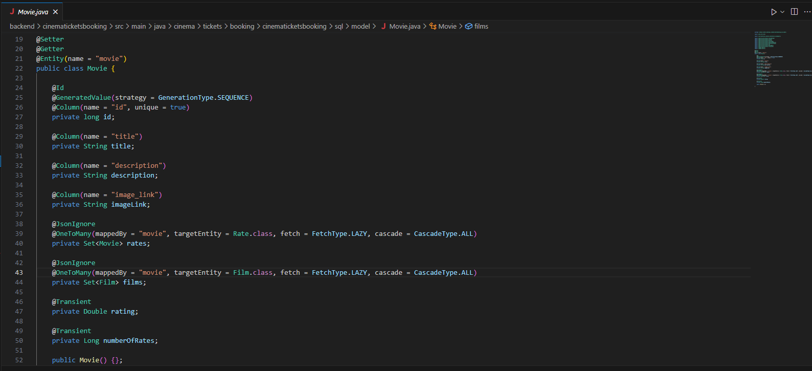

# Cinema Website
## Website of a cinema createn with React and Spring Boot
>**Warning**
>Most of the new changes can be found on separate branches

FRONTEND created by: <a href="https://github.com/jakub-sieradzki">Jakub Sieradzki</a> 
BACKEND created by: <a href="https://github.com/dawid-poradzinski">Dawid Poradzinski</a>

  
The appearance of our frontend

  
  
The method of data transfer via the backend

    
    

